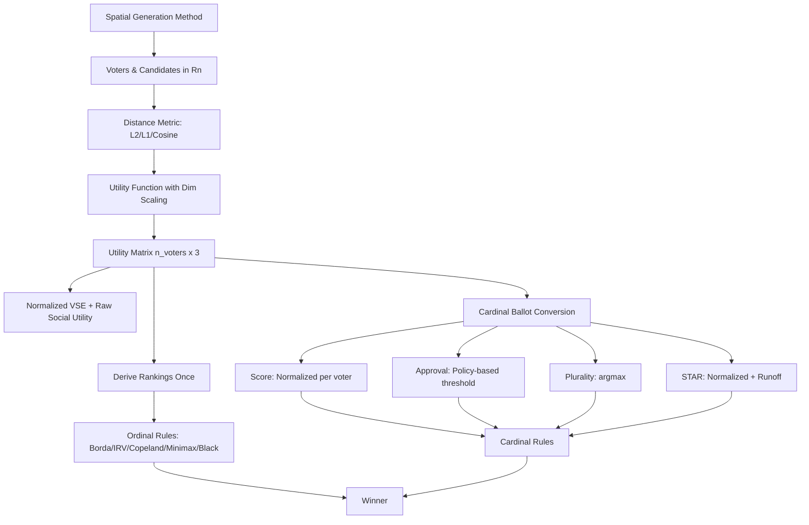

# Vector-Based Voting Simulator Rewrite

## Architecture Overview




## Implementation Plan

### 1. Create `expanded_rules.py`

**Purpose**: New voting rules file with proper utility-based ballot conversion and dimension-aware calculations

**Key components**:

#### Distance Metrics (configurable)
- `compute_distances(voter_pos, candidate_pos, metric='l2')`: Vectorized distance computation
  - `'l2'`: Euclidean distance (default) - standard spatial interpretation
  - `'l1'`: Manhattan distance - grid-based spatial interpretation
  - `'cosine'`: Cosine distance (1 - cosine similarity) - **EXPERIMENTAL**
    - **Important**: Cosine assumes directional vectors, not bounded spatial points
    - With [0,1]^n coordinates, cosine is poorly defined
    - Implementation: Normalize voter and candidate vectors to unit length first
    - Document as "belief-direction" mode, not truly spatial
    - Only compatible with Gaussian utility (no d_max normalization)
  - Returns: (n_voters, 3) distance matrix
  - **Cache d_max** for L2/L1 metrics (not used for cosine)

#### Utility Functions (dimension-aware)
- `gaussian_utility(distances, n_dim, sigma_factor=0.5)`:
  - sigma = sigma_factor * sqrt(n_dim) to scale with dimension
  - u = exp(-d² / (2 * sigma²))
  - **Compatible with all distance metrics** (including cosine)
  
- `quadratic_utility(distances, d_max)`:
  - u = max(0.0, 1 - (d / d_max)²)
  - **Always clamp to [0, 1]** to prevent negative utilities
  - **Only for L2/L1 metrics** - requires valid d_max
  - **Incompatible with cosine** - cosine shouldn't use d_max normalization
  
- `linear_utility(distances, d_max)`:
  - u = max(0.0, 1 - d / d_max)
  - **Only for L2/L1 metrics** - requires valid d_max
  - **Incompatible with cosine** - cosine shouldn't use d_max normalization

**Validation**: Raise error if quadratic/linear utility requested with cosine metric

#### Ballot Conversion Functions
- `utilities_to_scores(utilities, score_max=5)`:
  - Per-voter normalization: s = score_max * (u - min_u) / (max_u - min_u)
  
- `utilities_to_approval(utilities, policy='top_k', param=0.5)`:
  - **Explicit threshold policies**:
    - `'top_k'`: Approve top k% of candidates (param = k/100)
      - **Rounding rule**: Use `ceil(param * n_candidates)` for consistency
      - With 3 candidates: 0.33 → approve 1, 0.5 → approve 2, 0.67 → approve 2, 1.0 → approve 3
      - **Note**: Coarse with only 3 candidates, consider other policies
    - `'delta'`: Approve within param of best (u >= u_best - param)
      - More fine-grained control than top_k
    - `'mean'`: Approve above mean utility (u >= mean(u))
      - Typically approves 1-2 candidates
    - `'absolute'`: Approve if u >= param (fixed threshold)
      - Unstable across different utility functions
  
- `utilities_to_rankings(utilities, epsilon=1e-9)`:
  - Sort candidates by utility descending
  - Handle epsilon-ties: if |u_i - u_j| < epsilon, consider tied
  - Returns: (n_voters, 3) ranking matrix

#### Cardinal Voting Rules
- `score_voting(utilities, score_max=5)`: Sum per-voter normalized scores
- `approval_voting(utilities, policy, param)`: Count approvals
- `plurality(utilities)`: argmax per voter, count first choices
- `star_voting(utilities, score_max=5)`: 
  - Round 1: Normalize utilities to scores per voter, sum to find top 2
  - Round 2 (Automatic Runoff): **Ordinal comparison**
    - For each voter, determine which finalist they scored higher
    - Count preferences, winner = majority preferred
    - **Important**: Use ordinal preference (A scored > B scored), not raw utility difference
    - This matches STAR's actual semantics: voters express ordinal preferences in runoff

#### Ordinal Voting Rules (take pre-computed rankings)
**Key principle**: Compute rankings ONCE per profile, pass explicitly

- `borda(rankings)`: Apply Borda count to rankings (2-1-0 points)
- `instant_runoff(rankings)`: IRV elimination
- `copeland(rankings)`: Pairwise win/loss/tie scores
- `minimax(rankings)`: Minimize worst defeat
- `plurality_runoff(rankings)`: Top 2, then pairwise
- `black(rankings)`: Condorcet winner if exists, else Borda

#### Configuration
- `VOTING_RULES` dict with metadata:
  ```python
  {
    'score': {
      'func': score_voting,
      'type': 'cardinal',
      'requires': 'utilities'
    },
    'borda': {
      'func': borda,
      'type': 'ordinal', 
      'requires': 'rankings'
    },
    # ...
  }
  ```

### 2. Rewrite Profile Generation in `paradox_simulator.py`

**IMPORTANT**: Rename methods to clarify spatial nature and avoid confusion with ordinal "impartial culture"

**New spatial generation functions**:

- **`gen_spatial_uniform(n_voters, n_profiles, n_dim=2)`** (was impartial_culture):
  - Voters: uniform random in unit hypercube [0,1]ⁿ
  - Candidates: uniform random per profile
  - Most "unbiased" spatial distribution

- **`gen_spatial_clustered(n_voters, n_profiles, n_dim=2, phi=0.5)`** (replaces Mallows):
  - Random center point in unit hypercube
  - Voters: Gaussian around center with variance = phi * sqrt(n_dim)
  - Candidates: Also from same cluster with smaller variance
  - Interprets phi as spatial variance, not ranking perturbation
  - phi=0: all at same point, phi=1: wide scatter

- **`gen_spatial_single_peaked(n_voters, n_profiles, n_dim=1)`**:
  - **Force n_dim=1** (left-right spectrum)
  - Candidates at fixed positions (0.2, 0.5, 0.8) for consistency
  - Voters uniformly distributed on [0,1]
  - Naturally produces single-peaked preferences

- **`gen_spatial_polarized(n_voters, n_profiles, n_dim=2)`**:
  - Two main clusters at opposite corners (e.g., [0.1, 0.1] and [0.9, 0.9])
  - Random faction sizes 35-50% each
  - Small centrist cluster (remaining voters) around [0.5, 0.5]
  - Candidates positioned strategically: one near each cluster, one center

- **`gen_spatial_1d(n_voters, n_profiles)`**:
  - Identical to spatial_single_peaked but keep as separate name
  - For consistency with current naming

- **`gen_spatial_2d(n_voters, n_profiles)`**:
  - Candidates form equilateral triangle in unit square
  - Voters uniform in unit square
  - 2D generalization of spatial model

**REMOVED: gen_impartial_anonymous**
- IAC requires specific ranking distributions, incompatible with spatial model
- Voters would need to be placed to match Dirichlet-sampled ranking counts
- This breaks spatial interpretation (voters not genuinely "spatial")
- Drop this method for spatial simulations

**Return format**: `(voter_positions, candidate_positions)` where:
- `voter_positions`: (n_profiles, n_voters, n_dim)
- `candidate_positions`: (n_profiles, 3, n_dim)

**Registry update**:
```python
GENERATION_METHODS = {
    'spatial_uniform': (gen_spatial_uniform, "Uniform random in hypercube"),
    'spatial_clustered': (gen_spatial_clustered, "Clustered around center (phi=variance)"),
    'spatial_single_peaked': (gen_spatial_single_peaked, "1D left-right spectrum"),
    'spatial_polarized': (gen_spatial_polarized, "Two opposing clusters"),
    'spatial_1d': (gen_spatial_1d, "1D uniform distribution"),
    'spatial_2d': (gen_spatial_2d, "2D triangle + uniform voters"),
}
```

### 3. Update Core Simulation Logic

**Modify `simulate_paradox()` function** with vectorization and ranking separation:

```python
def simulate_paradox(voting_rule, n_profiles, n_voters, 
                     gen_method='spatial_uniform', 
                     n_dim=2, sigma_factor=0.5, utility_func='gaussian',
                     distance_metric='l2', approval_policy='top_k',
                     approval_param=0.5, rng_seed=None):
    # Set RNG seed for reproducibility
    if rng_seed is not None:
        np.random.seed(rng_seed)
        print(f"RNG seed: {rng_seed}")
    
    # Generate spatial profiles
    gen_func = GENERATION_METHODS[gen_method][0]
    voter_positions, candidate_positions = gen_func(n_voters, n_profiles, n_dim)
    
    # Get rule metadata
    rule_info = VOTING_RULES[voting_rule]
    rule_func = rule_info['func']
    rule_type = rule_info['type']  # 'cardinal' or 'ordinal'
    
    cycle_count = 0
    type1_count = 0
    type2_count = 0
    vse_values = []
    raw_social_utilities = []  # Track for analysis
    regrets = []  # U_optimal - U_elected per profile
    rank_counts = np.zeros(3, dtype=int)  # Count winners by rank [1st, 2nd, 3rd]
    
    # For each profile:
    for i in range(n_profiles):
        # 1. VECTORIZED: Compute distances for all voters and candidates at once
        distances = compute_distances(
            voter_positions[i], 
            candidate_positions[i],
            metric=distance_metric
        )  # (n_voters, 3)
        
        # Cache d_max for this profile
        d_max = compute_d_max(candidate_positions[i], distance_metric)
        
        # 2. VECTORIZED: Compute utilities from distances
        if utility_func == 'gaussian':
            sigma = sigma_factor * np.sqrt(n_dim)  # Scale with dimension
            utilities = np.exp(-distances**2 / (2 * sigma**2))
        elif utility_func == 'quadratic':
            utilities = np.maximum(0.0, 1.0 - (distances / d_max)**2)  # Clamp
        elif utility_func == 'linear':
            utilities = np.maximum(0.0, 1.0 - distances / d_max)
        
        # 3. SEPARATE: Compute rankings ONCE for ordinal rules and cycle detection
        rankings = utilities_to_rankings(utilities, epsilon=1e-9)
        
        # 4. Compute winner based on rule type
        if rule_type == 'cardinal':
            # Cardinal rules receive utilities
            if voting_rule == 'approval':
                winner_idx = rule_func(utilities, approval_policy, approval_param)
            else:
                winner_idx = rule_func(utilities)
        else:  # ordinal
            # Ordinal rules receive pre-computed rankings
            winner_idx = rule_func(rankings)
        
        # 5. Calculate NORMALIZED VSE and enhanced metrics using TRUE utilities
        vse, raw_social_utility, regret, winner_rank = compute_vse_and_metrics(
            utilities, winner_idx
        )
        vse_values.append(vse)
        raw_social_utilities.append(raw_social_utility)
        regrets.append(regret)
        rank_counts[winner_rank] += 1
        
        # 6. Condorcet cycle detection from rankings
        margins = compute_margins_from_rankings(rankings)
        if is_cycle(margins):
            cycle_count += 1
            # ... classify type
    
    return {
        'total_profiles': n_profiles,
        'cycle_count': cycle_count,
        # ... other stats
        'vse_mean': np.mean(vse_values),
        'vse_std': np.std(vse_values),
        'vse_min': np.min(vse_values),  # worst-case VSE
        'vse_max': np.max(vse_values),
        'raw_social_utility_mean': np.mean(raw_social_utilities),
        'regret_mean': np.mean(regrets),  # U_optimal - U_elected
        'regret_max': np.max(regrets),  # worst regret
        'winner_rank_1st': rank_counts[0],  # % winners were optimal
        'winner_rank_2nd': rank_counts[1],  # % winners were 2nd best
        'winner_rank_3rd': rank_counts[2],  # % winners were worst
        'rng_seed': rng_seed,
        # ...
    }
```

**Vectorized distance computation**:

```python
def compute_distances(voter_positions, candidate_positions, metric='l2'):
    """
    VECTORIZED distance computation.
    voter_positions: (n_voters, n_dim)
    candidate_positions: (3, n_dim)
    Returns: (n_voters, 3) distance matrix
    """
    n_voters = voter_positions.shape[0]
    
    if metric == 'l2':
        # Euclidean: ||v - c||_2
        # Broadcasting: (n_voters, 1, n_dim) - (1, 3, n_dim)
        diff = voter_positions[:, np.newaxis, :] - candidate_positions[np.newaxis, :, :]
        distances = np.sqrt(np.sum(diff**2, axis=2))
    elif metric == 'l1':
        # Manhattan: sum(|v - c|)
        diff = voter_positions[:, np.newaxis, :] - candidate_positions[np.newaxis, :, :]
        distances = np.sum(np.abs(diff), axis=2)
    elif metric == 'cosine':
        # Cosine distance: 1 - cosine_similarity
        # IMPORTANT: Normalize vectors to unit length for proper directional comparison
        # This transforms [0,1]^n spatial coords into belief-direction representation
        
        # Normalize to unit length
        v_norms = np.linalg.norm(voter_positions, axis=1, keepdims=True)
        c_norms = np.linalg.norm(candidate_positions, axis=1, keepdims=True)
        v_normalized = voter_positions / (v_norms + 1e-10)  # (n_voters, n_dim)
        c_normalized = candidate_positions / (c_norms + 1e-10)  # (3, n_dim)
        
        # Compute cosine similarity
        cos_sim = np.dot(v_normalized, c_normalized.T)  # (n_voters, 3)
        cos_sim = np.clip(cos_sim, -1.0, 1.0)  # Handle numerical errors
        
        # Cosine distance = 1 - cosine_similarity (range [0, 2])
        distances = 1.0 - cos_sim
    
    return distances

def compute_d_max(candidate_positions, metric='l2'):
    """
    Cache maximum possible distance in unit hypercube.
    NOT USED for cosine metric (cosine shouldn't normalize with d_max).
    """
    n_dim = candidate_positions.shape[1]
    
    if metric == 'l2':
        return np.sqrt(n_dim)  # diagonal of unit hypercube
    elif metric == 'l1':
        return n_dim  # sum of max differences
    elif metric == 'cosine':
        # Return None to signal d_max is not applicable
        # Cosine distance should only use Gaussian utility
        return None
    
    return 1.0
```

**Updated VSE calculation** with enhanced metrics:

```python
def compute_vse_and_metrics(utilities, winner_idx):
    """
    Compute NORMALIZED VSE and enhanced metrics based on true utilities.
    
    Metrics:
    - VSE = (U_elected - U_random) / (U_optimal - U_random)
    - Regret = U_optimal - U_elected
    - Winner rank = social utility rank of winner (0=best, 1=2nd, 2=3rd)
    
    utilities: (n_voters, 3)
    winner_idx: int (0, 1, or 2)
    
    Returns: (normalized_vse, raw_social_utility, regret, winner_rank)
    """
    avg_utilities = np.mean(utilities, axis=0)  # average utility per candidate (social utility)
    u_elected = avg_utilities[winner_idx]  # social utility of winner
    u_optimal = np.max(avg_utilities)  # utilitarian optimum
    u_random = np.mean(avg_utilities)  # random selection baseline
    
    # Compute regret
    regret = u_optimal - u_elected
    
    # Compute winner's rank (0=1st, 1=2nd, 2=3rd)
    sorted_indices = np.argsort(avg_utilities)[::-1]  # descending order
    winner_rank = np.where(sorted_indices == winner_idx)[0][0]
    
    # Handle edge case: all candidates equally good
    if abs(u_optimal - u_random) < 1e-10:
        normalized_vse = 1.0 if abs(regret) < 1e-10 else 0.0
    else:
        normalized_vse = (u_elected - u_random) / (u_optimal - u_random)
    
    return normalized_vse, u_elected, regret, winner_rank
```


### 4. Configuration Options

Add comprehensive command-line arguments:

**Spatial Configuration**:
- `--n-dim` / `-d`: Dimension of vector space (default: 2)
- `--distance-metric`: Choice of 'l2', 'l1', 'cosine' (default: 'l2')

**Utility Function**:
- `--utility-func`: Choice of 'gaussian', 'quadratic', 'linear' (default: 'gaussian')
- `--sigma-factor`: Sigma scaling factor (sigma = factor * sqrt(n_dim)) (default: 0.5)

**Ballot Conversion**:
- `--approval-policy`: Policy for approval threshold
  - 'top_k': Approve top k% (default)
  - 'delta': Approve within delta of best
  - 'mean': Approve above mean utility
  - 'absolute': Fixed threshold
- `--approval-param`: Parameter for approval policy (default: 0.5)
  - For 'top_k': 0.5 means top 50%
  - For 'delta': 0.2 means within 0.2 of best
  - For 'absolute': 0.5 means u >= 0.5
- `--score-max`: Maximum score for score voting (default: 5)

**Reproducibility**:
- `--rng-seed`: Random number generator seed for reproducibility (default: None)
- `--epsilon`: Epsilon for tie-breaking in rankings (default: 1e-9)

**Enhanced Logging**:
- `--log-raw-utility`: Add raw social utility to table output (flag)
- `--log-regret`: Add regret (U_optimal - U_elected) to table output (flag)
- `--log-winner-rank`: Add winner rank distribution (1st/2nd/3rd) to table output (flag)
- `--verbose`: Print detailed per-profile information (flag)

**Future Extension**:
- `--n-candidates`: Number of candidates (default: 3)
  - Architecture already supports arbitrary number
  - Would require updating cycle detection (only works for 3)
  - Consider as future enhancement

### 5. Preserve Existing Features

**Keep all current functionality**:
- All CLI flags (-m, -r, -b, -n, -v)
- Interactive mode
- Table formatting and colored output
- Condorcet cycle detection (via rankings derived from utilities)
- All table output metrics (cycles, VSE, etc.)

**Update table output** to include enhanced metrics:

**Core metrics** (always shown):
- Cycles (%), Type 1 (%), Type 2 (%)
- VSE Mean, VSE Std, VSE Min (worst-case)

**Enhanced metrics** (optional flags):
- `--log-raw-utility`: Add raw social utility column
- `--log-regret`: Add regret (U_optimal - U_elected) column
- `--log-winner-rank`: Add columns showing % of winners by rank (1st/2nd/3rd best)

**Table header** should note:
- Distance metric used (L2/L1/cosine)
- Utility function (gaussian/quadratic/linear)
- Key parameters (sigma_factor, approval_policy)

### 6. Key Files Modified

- **[paradox_simulator.py](paradox_simulator.py)**: Complete rewrite
  - Spatial generation methods (renamed)
  - Vectorized utility computation
  - Separation of cardinal/ordinal rules
  - Enhanced configuration
  
- **[expanded_rules.py](expanded_rules.py)**: NEW file
  - Distance metrics (L2, L1, cosine)
  - Utility functions (dimension-aware)
  - Ballot conversion (explicit policies)
  - Voting rules (cardinal and ordinal)
  
- **[voting_rules.py](voting_rules.py)**: Unchanged (deprecated)
  - Keep for backward compatibility or reference
  - Could be removed in future version

### 7. Implementation Notes

**Critical fixes incorporated**:
1. ✓ Distance metric configurable (L2, L1, cosine)
2. ✓ Sigma scales with sqrt(n_dim) to handle dimension growth
3. ✓ Quadratic utility clamped to [0, 1]
4. ✓ Approval threshold policy explicit (top-k%, delta, mean, absolute)
5. ✓ Rankings computed once, passed to ordinal rules
6. ✓ Generation methods renamed (spatial_uniform, etc.)
7. ✓ Mallows reinterpreted as spatial_clustered with variance phi
8. ✓ VSE clearly documented as normalized, raw utility optionally logged
9. ✓ Vectorized distance and utility computation
10. ✓ d_max cached per profile
11. ✓ Epsilon-tie handling in rankings
12. ✓ RNG seed for reproducibility

**Performance optimizations**:
- Vectorized distance computation: ~10-100x faster
- Cached d_max: Avoid repeated sqrt(n_dim) calls
- Single ranking derivation: Avoid repeated sorting for ordinal rules

**Edge cases handled**:
- All candidates equally good: VSE = 1.0 if winner optimal, else 0.0
- Negative utilities from quadratic: Always clamped to [0, 1]
- High dimensions: Sigma scaling prevents utility collapse
- Epsilon ties: Consistent tie-breaking in rankings

### 8. Testing Strategy

**Unit tests needed**:
1. Distance metrics produce correct values (L2, L1, cosine)
2. Utility functions scale correctly with dimension
3. Quadratic utility never negative
4. Approval policies behave as expected
5. Rankings derived correctly from utilities
6. VSE normalization correct for edge cases

**Integration tests**:
1. Each voting rule produces valid winners
2. Ordinal rules work with rankings only
3. Cardinal rules work with utilities only
4. All generation methods produce valid positions
5. Cycle detection works with derived rankings

**Validation tests**:
1. **Score voting should have VSE ≈ 1.0** (it maximizes social utility by definition)
   - Score is the utilitarian baseline
   - Borda should have high VSE (0.90-0.95) but < 1.0
2. Single-peaked → no Condorcet cycles (guaranteed by single-peaked property)
3. Higher dimensions → utilities more concentrated (distance concentration)
4. Different sigma values → different VSE spreads
5. Cosine + Gaussian should produce valid results (experimental validation)

**Note on cycle frequencies**:
- Do NOT use "~8-9% cycles" as validation target
- Spatial models typically produce fewer cycles than ordinal IC
- Cycle rates heavily depend on sigma, dimension, and distance metric
- Treat cycle rate as an observed metric, not a validation criterion

## Benefits of This Design

1. **Clean separation**: Belief space → distance → utility → ballot → winner
2. **Method-appropriate ballots**: Each rule gets proper ballot format (no more fake scores)
3. **True VSE**: Based on actual spatial utilities, not inferred from rankings
4. **Dimension-aware**: Sigma scaling and distance metrics handle high dimensions correctly
5. **Avoids normalization errors**: Per-voter normalization only where appropriate
6. **Explicit policies**: Approval thresholds clearly defined and configurable
7. **Scientifically rigorous**: All design choices documented and justified
8. **Extensible**: Easy to add new distance metrics, utility functions, or voting rules
9. **Reproducible**: RNG seeding and deterministic computation
10. **Performant**: Vectorized operations for speed

## Critical Fixes and Refinements Applied

### Correctness Fixes
1. **✓ Score voting is utilitarian baseline**, not Borda (validation tests corrected)
2. **✓ Cosine distance normalized** - vectors normalized to unit length before comparison
3. **✓ Cosine only with Gaussian** - quadratic/linear utilities incompatible (validation added)
4. **✓ STAR runoff is ordinal** - uses pairwise preferences, not raw utility differences
5. **✓ Approval top_k rounding explicit** - uses ceil(k * n_candidates) for consistency
6. **✓ No cycle frequency targets** - spatial models differ from IC, rates are observed not validated

### Enhanced Metrics (Optional)
7. **✓ Winner social utility rank** - tracks if winner was 1st/2nd/3rd best candidate
8. **✓ Regret tracking** - U_optimal - U_elected for each profile
9. **✓ Worst-case VSE** - min VSE across profiles (robustness metric)
10. **✓ Raw social utility logging** - alongside normalized VSE for analysis

### Documentation Improvements
11. **✓ Cosine documented as experimental** - "belief-direction" mode, not truly spatial
12. **✓ Approval coarseness noted** - only 3 candidates makes top_k jumpy
13. **✓ d_max handling clarified** - returns None for cosine (not applicable)
14. **✓ Utility clamping explicit** - always [0, 1] for quadratic/linear

### Future Extensions Noted
15. **✓ Support n > 3 candidates** - architecture ready, cycle detection needs update
16. **✓ Additional distance metrics** - framework supports easy addition
17. **✓ More utility functions** - e.g., exponential with different decay rates